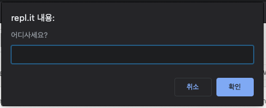

# [🚀 Check Point] 10. 논리연산자

## 10-1. 논리 연산자(Logical Operators)의 필요성

if문으로 조건문을 생성하는 법을 이전시간에 배웠습니다. 다시 한 번 볼까요?



```js
const answer = prompt("어디사세요?");

if (answer === "선릉") {
  alert("가까우시네요!");
} else if (answer === "강남") {
  alert("가까우시네요!");
} else if (answer === "을지로") {   
  alert("조금 멀리 사시네요."); 
} else {
 alert("거긴 어디인가요?");
}
```

위의 조건문을 보면 answer가 "선릉", "강남"일 때는 조건은 다르지만 같은 결과를 리턴 합니다. 만약 역삼, 삼성도 조건문에 추가하는데, 같은 결과를 리턴해야 한다면? 대략 4줄이 추가 되어야겠네요. 결과는 같은데 조건문만 달리 쓰려니 뭔가.. 귀찮기도 하고, 생산성 없이 느껴집니다. 

이럴 때는 같은 결과에 해당하는 조건을 묶을 수 있습니다.

```js
if (선릉 또는 강남 또는 삼성 또는 역삼) {   
    alert("가까우시네요!"); 
} 
```

---

## 10-2. 논리 연산자의 사용법

바로 "또는(or)" 이라는 논리 연산자를 사용하는 것입니다. "또는(or)"에 해당하는 JavaScript 연산자는 `||` 입니다. (`shift + \`)

아래처럼 다시 작성 해볼 수 있습니다.

```js
const answer = prompt("어디사세요?");

if (answer === "선릉" || answer === "강남" || answer === "역삼") {
  alert("가까우시네요!");
} else if (answer === "을지로") {   
  alert("조금 멀리 사시네요."); 
} else {
 alert("거긴 어디인가요?");
}
```

조건문을 한 번 살펴봅시다. 하나의 if 문에 참(true)/거짓(false)을 판단할 조건은 세 개(선릉,강남,역삼)입니다. prompt 함수에서 리턴받은 answer가 선릉, 강남, 역삼 중 하나일 경우. 즉, 저 셋 중에 하나로 대답하면 해당 if문이 실행됩니다.


이번에는 취미와 성향을 받아서 동아리를 추천해보려고 합니다. 취미가 꼭 축구여야하고, 아침형 인간만 조기축구회를 추천해드릴거예요. (취미가 축구인데, 저녁형 인간이면 추천 안 합니다.)

이렇게 **어떤 조건 하나만 맞으면 되는 것이 아니라 모두 충족해야할 때 사용하는 "그리고(and)" 연산자인 `&&`** 를 보겠습니다.

```js
const hobby = prompt("취미가 무엇인가요?");
const morning = prompt("아침형 인간인가요?");

if (hobby === "축구" && morning === "네") {
  alert("조기축구회를 추천합니다.");
} else {
  alert("무슨 동아리가 좋을지 생각해볼게요.");
}
```

위의 코드를 작성하고 테스트 해봅시다.

---

## 10-3. 연산자를 활용한 조건문의 다양한 표현

다음은 여러가지 연산자를 활용한 if문에서 표현할 수 있는 다양한 표현입니다. 하나하나씩 보고 먼저 이해하는 시간을 가져봅시다.

```js
if (age > 65 || age < 21 && res === "한국")
```

아! 정말 헷갈리네요. 이렇게도 저렇게도 해석이 될 것 같습니다. 일단 `||` 가 먼저 있어서 `||` 기준으로 나누어봤습니다. 그럼 아래 중에 둘 중에 하나만 참이어도 if문이 실행됩니다.

- age가 65를 넘거나,
- age가 21보다 아래이면서 사는 곳은 한국이다.


이런 해석이라면 아래와 같은 경우 참입니다.(예)

- 66세이다.
- 20이면서 한국에 산다.

그 다음으로 && 기준으로 나누었습니다. 이렇다면 두개의 조건이 다 맞아야합니다.

- age가 65를 넘거나 age가 21보다 아래이다.
- 그리고 사는 곳은 한국이다.


이런 해석이라면 아래와 같은 경우 참입니다.(예)

- 66세 한국에 산다.
- 20세 한국에 산다.

위의 두 가지 해석중 무엇이 맞을까요? 컴퓨터 언어는 왼쪽에서 부터 해석하기 때문에 위가 맞는 해석입니다. 컴퓨터는 본인이 정한 기준으로 실행이 되지만, 개발자인 사람은 볼 때마다 헷갈리는 경우가 있으니 항상 괄호로 묶어주는 습관을 들이면 좋을 것 같습니다. 위의 코드를 가독성있게 바꾼 다면, 아래와 같을 것입니다.

```js
if (age > 65 || (age < 21 && res === "한국"))
```

혹시 두 번째 해석이 원했던 결과라면 아래와 같이 괄호를 묶어주셔야 합니다.

```js
if ((age > 65 || age < 21) && res === "한국"))
```

---

# Assignment

### index.js에 있는 가위 바위 보 게임 함수를 아래 조건에 맞게 구현해주세요.

- `rockPaperScissors` 함수를 구현해서 가위 바위 보 게임을 구현해주세요.
- **가능하면 || 와 && 연산자 둘다 사용해주세요.**
- player1과 player2 중 이긴 사람이 누군지 리턴해주세요.
- 예를 들어, player1이 이겼으면 "player1" 이 리턴 되고 그 반대의 경우라면 "player2"가 리턴이 되어야 합니다.
- 만일 비기는 경우에는 무조건 "player1"이 리턴 되어야 합니다.
- player1 과 player2 의 값은 다음 셋 중 하나 입니다.
    - "가위"
    - "바위"
    - "보"
- 예를 들어, player1은 "가위" 이고 player2는 "보" 이면 "player1" 이 리턴 되어야 합니다.